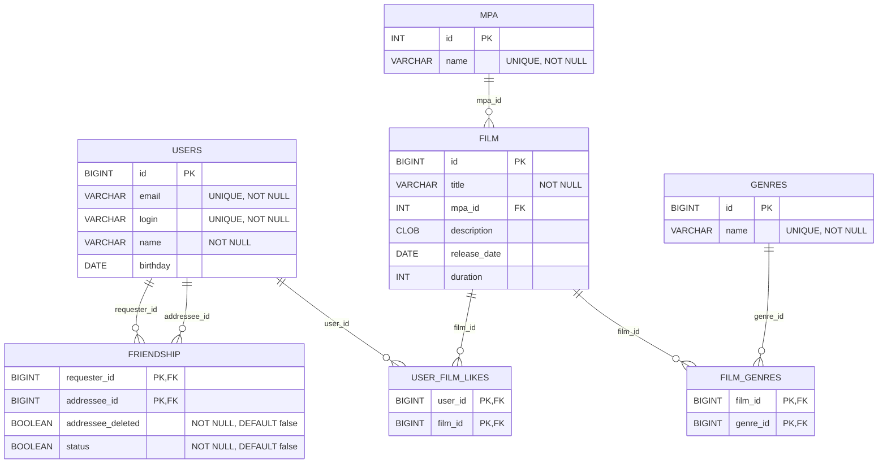

Diagram DB:

```mermaid
erDiagram
  USERS {
    BIGINT id PK
    VARCHAR email "UNIQUE, NOT NULL"
    VARCHAR login "UNIQUE, NOT NULL"
    VARCHAR name "NOT NULL"
    DATE birthday
  }

  FRIENDSHIP {
    BIGINT requester_id PK, FK
    BIGINT addressee_id PK, FK
    BOOLEAN addressee_deleted "NOT NULL, DEFAULT false"
    BOOLEAN status "NOT NULL, DEFAULT false"
  }

  GENRES {
    BIGINT id PK
    VARCHAR name "UNIQUE, NOT NULL"
  }

  MPA {
    INT id PK
    VARCHAR name "UNIQUE, NOT NULL"
  }

  FILM {
    BIGINT id PK
    VARCHAR title "NOT NULL"
    INT mpa_id FK
    CLOB description
    DATE release_date
    INT duration
  }

  USER_FILM_LIKES {
    BIGINT user_id PK, FK
    BIGINT film_id PK, FK
  }

  FILM_GENRES {
    BIGINT film_id PK, FK
    BIGINT genre_id PK, FK
  }

  USERS ||--o{ FRIENDSHIP : "requester_id"
  USERS ||--o{ FRIENDSHIP : "addressee_id"

  MPA ||--o{ FILM : "mpa_id"

  USERS ||--o{ USER_FILM_LIKES : "user_id"
  FILM  ||--o{ USER_FILM_LIKES : "film_id"

  FILM   ||--o{ FILM_GENRES : "film_id"
  GENRES ||--o{ FILM_GENRES : "genre_id"
```