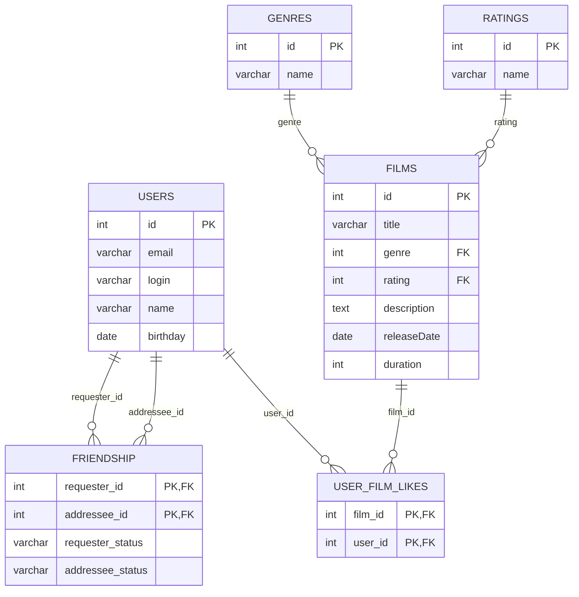

Diagram DB:

```mermaid
erDiagram
    USERS {
        int id PK
        varchar email
        varchar login
        varchar name
        date birthday
    }

    FRIENDSHIP {
        int requester_id PK,FK
        int addressee_id PK,FK
        varchar requester_status
        varchar addressee_status
    }

    USER_FILM_LIKES {
        int film_id PK,FK
        int user_id PK,FK
    }

    FILMS {
        int id PK
        varchar title
        int genre FK
        int rating FK
        text description
        date releaseDate
        int duration
    }

    GENRES {
        int id PK
        varchar name
    }

    RATINGS {
        int id PK
        varchar name
    }

    USERS ||--o{ FRIENDSHIP : requester_id
    USERS ||--o{ FRIENDSHIP : addressee_id

    USERS ||--o{ USER_FILM_LIKES : user_id
    FILMS ||--o{ USER_FILM_LIKES : film_id

    GENRES ||--o{ FILMS : genre
    RATINGS ||--o{ FILMS : rating
```