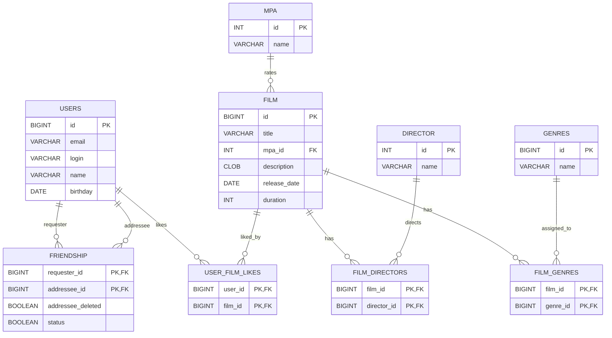

Diagram DB:

```mermaid
erDiagram
    USERS {
        BIGINT id PK
        VARCHAR email
        VARCHAR login
        VARCHAR name
        DATE birthday
    }

    FRIENDSHIP {
        BIGINT requester_id PK, FK
        BIGINT addressee_id PK, FK
        BOOLEAN addressee_deleted
        BOOLEAN status
    }

    GENRES {
        BIGINT id PK
        VARCHAR name
    }

    MPA {
        INT id PK
        VARCHAR name
    }

    DIRECTOR {
        INT id PK
        VARCHAR name
    }

    FILM {
        BIGINT id PK
        VARCHAR title
        INT mpa_id FK
        CLOB description
        DATE release_date
        INT duration
    }

    USER_FILM_LIKES {
        BIGINT user_id PK, FK
        BIGINT film_id PK, FK
    }

    FILM_GENRES {
        BIGINT film_id PK, FK
        BIGINT genre_id PK, FK
    }

    FILM_DIRECTORS {
        BIGINT film_id PK, FK
        BIGINT director_id PK, FK
    }

    USERS ||--o{ FRIENDSHIP : requester
    USERS ||--o{ FRIENDSHIP : addressee

    MPA ||--o{ FILM : rates

    USERS ||--o{ USER_FILM_LIKES : likes
    FILM ||--o{ USER_FILM_LIKES : liked_by

    FILM ||--o{ FILM_GENRES : has
    GENRES ||--o{ FILM_GENRES : assigned_to

    FILM ||--o{ FILM_DIRECTORS : has
    DIRECTOR ||--o{ FILM_DIRECTORS : directs
```